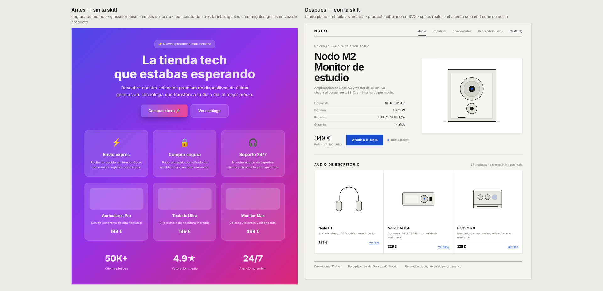

# ai-good-design

Una skill que evita que una web parezca hecha por IA.

*El mismo encargo — "una web para una tienda de tecnología" — hecho dos veces. A la
izquierda lo que sale por defecto: degradado morado, cristal, emojis de icono, todo
centrado, tres tarjetas iguales, rectángulos de color donde debería ir el producto y
"50K+ clientes felices". A la derecha, con la skill: retícula asimétrica, cada aparato
dibujado en SVG, specs que un comprador usa de verdad (48 Hz – 22 kHz, 2 × 55 W, USB-C ·
XLR · RCA) y el azul reservado para lo único que se pulsa.*

Le da al modelo la lista de delatores (degradado morado-azul, glassmorphism en todo,
emojis como iconos, todo centrado, tres tarjetas iguales, `Inter` para absolutamente
todo) y, más importante, qué hacer en su lugar: una escala tipográfica de verdad,
medida de 60-75 caracteres, un solo acento usado poco, contraste 4.5:1.

Es un solo `SKILL.md`. No necesita scripts, binarios ni permisos.

## Instalar

**Antigravity CLI**

    git clone https://github.com/iaguito22/ai-good-design ~/.gemini/config/skills/good-design

**Claude Code**

    git clone https://github.com/iaguito22/ai-good-design ~/.claude/skills/good-design

Reinicia la sesión. Se activa sola cuando pides una landing, un portfolio, un panel
o cualquier interfaz que una persona vaya a mirar, y también cuando dices que algo
"parece hecho con IA", "parece vibecoded" o "es genérico". Para forzarla:
`/good-design`.

## Licencia

MIT.
